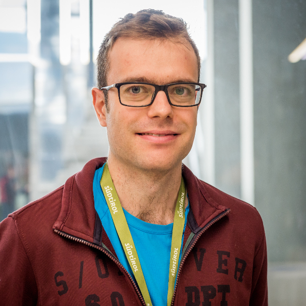
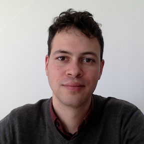
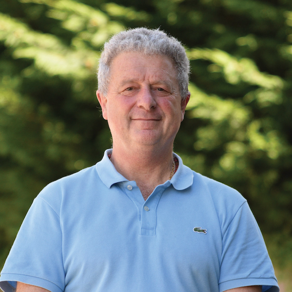
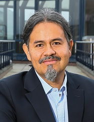
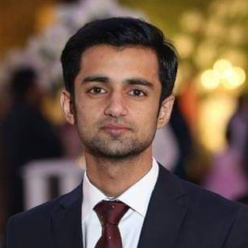
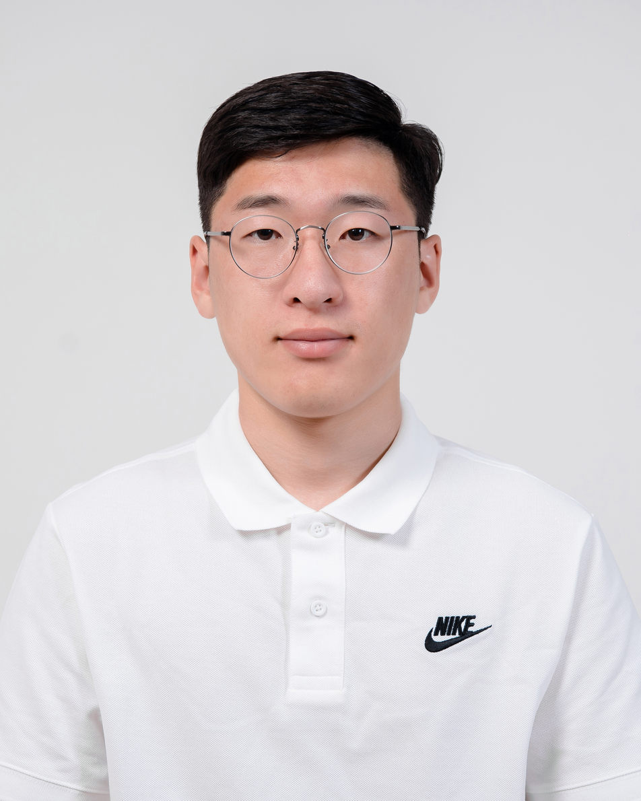

---
include-in-header:
  - text: |
      
---

## Organizing Committee

::: {.grid}

::: {.g-col-3}

:::

::: {.g-col-8}
[**Andrea Bontempelli**](https://www.abonte.eu/)  
*University of Trento*

Andrea Bontempelli is a postdoctoral researcher at the University of Trento working on interactive machine learning and concept drift with a focus on sensor data streams and noisy data. He also has expertise in research data management.
:::

::: {.g-col-3}

:::

::: {.g-col-8}
[**Matteo Busso**](https://orcid.org/0000-0002-3788-0203)  
*University of Trento*

Matteo Busso holds a Master's in Sociology and a PhD in Computer Science from the University of Trento (Italy), where he focused on integrating sociological methods into ubiquitous computing experiments. His research aims to gather high-quality data on individual diversity for social interactions. He teaches AI to non-experts and contributes to designing and implementing a research infrastructure for generating and sharing diversity-aware data.
:::

::: {.g-col-3}

:::

::: {.g-col-8}
[**Lakmal Meegahapola**](https://lakmalmeegahapola.com/)  
*ETH Zurich*

Lakmal Meegahapola is a postdoctoral researcher at ETH Zurich. He obtained his PhD from EPFL in 2024 and has also worked at Google Research, Nokia Bell Labs, the University of Cambridge, and Singapore Management University. His work lies at the intersection of mobile and wearable sensing, digital health, and machine learning, where he develops safe and robust AI/ML models for multimodal time series data. He is on the editorial board of ACM IMWUT, IEEE Pervasive Computing, and also is an Associate Chair of ACM CHI.
:::

::: {.g-col-3}

:::

::: {.g-col-3}

:::

::: {.g-col-8}
[**Fausto Giunchiglia**](https://fausto.disi.unitn.it/)  
*University of Trento*

Fausto Giunchiglia is a professor of Computer Science at the University of Trento working on end-to-end data-centric AI, from data collection to data analysis, with a special interest on the study of human behavior.
:::

::: {.g-col-3}

:::

::: {.g-col-8}
[**Daniel Gatica-Perez**](https://www.idiap.ch/~gatica/)  
*Idiap Research Institute & EPFL*

Daniel Gatica-Perez leads the Social Computing Group at Idiap and is a professor at EPFL. He has worked extensively on smartphone sensing research. He served as General Co-Chair of ACM Ubicomp/ISWC 2015, and currently serves as an Associate Editor of PACM IMWUT.
:::

:::

## Technical Support

::: {.grid}

::: {.g-col-3}

:::

::: {.g-col-8}
[**Ali Hamza**](https://ds.datascientia.eu/community/public/profile/U2FsdGVkX19%252FH6GODRZZI3dWoj2u74zF26zQyYAO9TTFNKcCpRBTOTLc0m8oQvht)  
*University of Trento*
:::

::: {.g-col-3}

:::

::: {.g-col-8}
[**Munkhdelger Bayanjargal**](http://www.linkedin.com/in/munkhdelger-bayanjargal-b2467a251)  
*University of Trento*
:::
:::