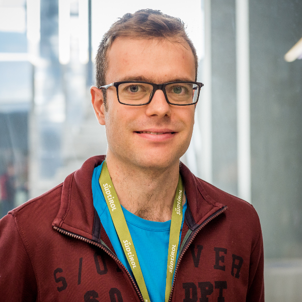
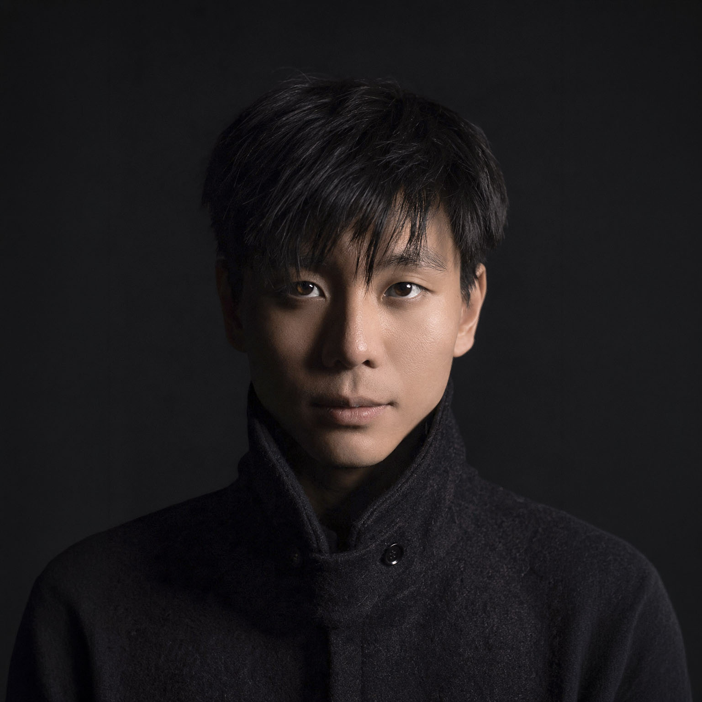
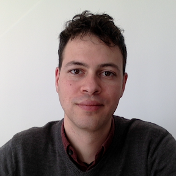
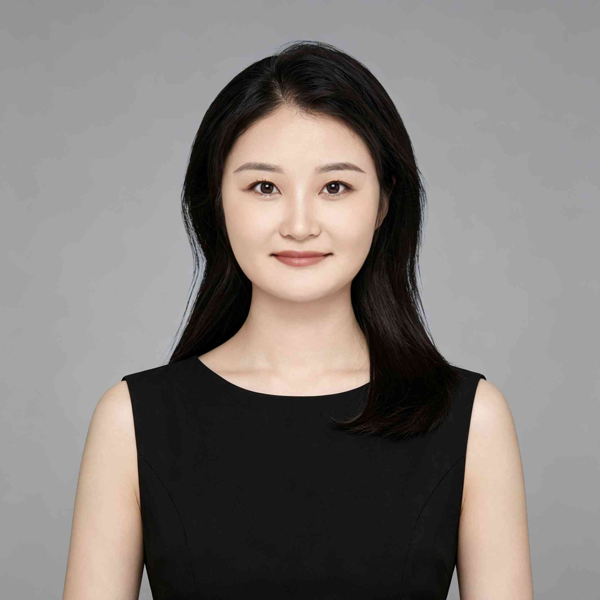
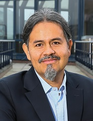
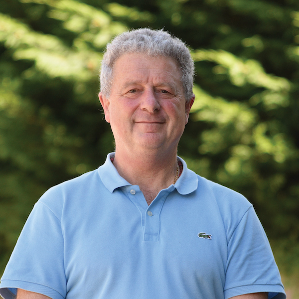
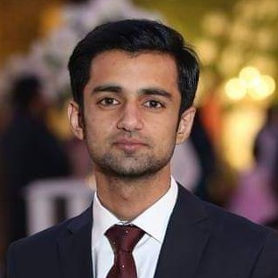

---
include-in-header:
  - text: |
      
---

## Program chairs

::: {.grid}

::: {.g-col-3}

:::

::: {.g-col-8}
[**Andrea Bontempelli**](https://www.abonte.eu/)  
*University of Trento, Italy*

Andrea Bontempelli is a postdoctoral researcher at the University of Trento working on interactive machine learning and concept drift with a focus on sensor data streams and noisy data. He also has expertise in research data management.
:::

::: {.g-col-3}

::: 

::: {.g-col-8}
[**Özlem Durmaz Incel**](https://ozlemdurmazincel.github.io/)  
*University of Twente, Netherlands*

Özlem Durmaz Incel is the Chair of the Pervasive Systems Research
Group at the University of Twente. Her research areas include applied machine learning, human activity and well-being recognition,
edge AI in wearable and ubiquitous computing, and the Internet of
Things. She serves as an Associate Editor of PACM IMWUT and
IEEE Internet Computing.
:::

::: {.g-col-3}

::: 

::: {.g-col-8}
[**Baiyu Chen (Breeze)**](https://baiyuchen.com)  
*University of New South Wales, Australia*

Baiyu Chen (Breeze) is a PhD student at UNSW Sydney. He received his Master of Information Technology with Excellence from
UNSW Sydney. His research focuses on human-centric multimodal
learning for wearable sensing, behavior modeling and proactive AI
assistants.

:::
:::

## Steering committee

::: {.grid}

::: {.g-col-3}

:::

::: {.g-col-8}
[**Matteo Busso**](https://orcid.org/0000-0002-3788-0203)  
*University of Trento, Italy*

Matteo Busso holds a Master's in Sociology and a PhD in Computer Science from the University of Trento (Italy), where he focused on integrating sociological methods into ubiquitous computing experiments. His research aims to gather high-quality data on individual diversity for social interactions. He teaches AI to non-experts and contributes to designing and implementing a research infrastructure for generating and sharing diversity-aware data.
:::

::: {.g-col-3}

:::

::: {.g-col-8}
[**Lakmal Meegahapola**](https://lakmalmeegahapola.com/)  
*Nokia Bell Labs, United Kingdom*

Lakmal Meegahapola is a Research Scientist at Nokia Bell Labs
in Cambridge, UK. Previously, he was a postdoctoral researcher
at ETH Zurich. He obtained his PhD from EPFL in 2024 and has
also worked at Google Research, University of Cambridge, and
Singapore Management University. His work lies at the intersection
of mobile and wearable sensing, digital health, and responsible AI,
where he develops safe and robust AI/ML models and LLM pipelines
for multimodal time series data. He is on the editorial board of ACM
IMWUT, IEEE Pervasive Computing, and also is an Associate Chair
of ACM CHI.
:::

::: {.g-col-3}

:::

::: {.g-col-8}
[**Wanyi Zhang**](https://orcid.org/0000-0002-3952-0826)  
*Chongqing University, China*

Wanyi Zhang is a postdoctoral research associate at Chongqing
University, China. She received her PhD from University of Trento, Italy. Her research focuses on context recognition, human behavior modeling, urban computing, and spatio-temporal trajectory
data mining, with applications in mobile sensing and ubiquitous
computing.
:::

::: {.g-col-3}

:::

::: {.g-col-8}
[**Flora Salim**](https://fsalim.github.io/)  
*University of New South Wales, Australia*

Flora Salim is a professor at UNSW Sydney. Her research areas
include multimodal machine learning for time-series, spatiotemporal, and mobility data, and robust AI. She has served as a Program
Co-Chair of ACM UbiComp/ISWC 2020 and an Editor of PACM
IMWUT (2022-2025). She is an Associate Editor-in-Chief of IEEE
Pervasive Computing, and a Vice Chair of the IEEE Task Force on
AI for Time-Series and Spatio-Temporal Data.
:::

::: {.g-col-3}

:::

::: {.g-col-8}
[**Daniel Gatica-Perez**](https://www.idiap.ch/~gatica/)  
*Idiap Research Institute & EPFL, Switzerland*

Daniel Gatica-Perez leads the Social Computing Group at Idiap and is a professor at EPFL. He has worked extensively on smartphone sensing research. He served as General Co-Chair of ACM Ubicomp/ISWC 2015, and currently serves as an Associate Editor of PACM IMWUT.
:::

::: {.g-col-3}

:::

::: {.g-col-8}
[**Fausto Giunchiglia**](https://fausto.disi.unitn.it/)  
*University of Trento, Italy*

Fausto Giunchiglia is a professor of Computer Science at the University of Trento working on end-to-end data-centric AI, from data collection to data analysis, with a special interest on the study of human behavior.
:::

:::

## Technical Support

::: {.grid}

::: {.g-col-3}

:::

::: {.g-col-8}
[**Ali Hamza**](https://ds.datascientia.eu/community/public/profile/U2FsdGVkX19%252FH6GODRZZI3dWoj2u74zF26zQyYAO9TTFNKcCpRBTOTLc0m8oQvht)  
*University of Trento*
:::
